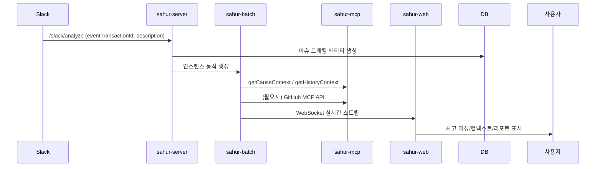

# SAHUR ARCHITECTURE

## Overview

SAHUR는 AI 기반 상호작용형 이슈 분석 및 해결 시스템입니다.  
개발 조직이 이슈 대응에 소모하는 리소스를 줄이고, 사고 과정을 실시간으로 투명하게 제공합니다.

## Monorepo Structure

```
sahur/
├── sahur-core/      # 공통 에이전트 로직 및 라이브러리
├── sahur-web/       # Next.js 프론트엔드 UI
├── sahur-server/    # FastAPI 메인 API 서버
├── sahur-batch/     # 이슈별 동적 분석 인스턴스
└── sahur-mcp/       # MCP 프록시 서버 (외부/내부 MCP 연동)
```

## Component Roles & Interaction

- **sahur-core**  
  - LangGraph 기반 에이전트 워크플로우, LLM 오케스트레이션, 분석 로직
  - 모든 컴포넌트가 pip install -e ../sahur-core로 의존

- **sahur-server**  
  - Slack webhook 수신, 이슈 트래킹 엔티티 생성 (PostgreSQL)
  - sahur-batch 인스턴스 동적 생성 및 관리
  - REST API, WebSocket 게이트웨이 제공

- **sahur-batch**  
  - 각 이슈별 독립 분석 인스턴스 (FastAPI)
  - sahur-core의 에이전트 로직 실행, 실시간 사고 과정 WebSocket 스트림
  - CauseContext/HistoryContext 관리, 처리 완료 후 자동 종료

- **sahur-web**  
  - 실시간 이슈 모니터링 및 상호작용 UI (Next.js, TypeScript, TailwindCSS)
  - /issue/tracking/{issueTrackingId} 경로로 이슈별 페이지
  - sahur-batch와 WebSocket 연결, 사고 과정/중간 결과/리포트 표시

- **sahur-mcp**  
  - 외부 MCP 서버 및 내부 MCP 기능 프록시 (FastAPI)
  - getCauseContext, getHistoryContext, GitHub MCP wrapper 등 제공
  - 모든 MCP 함수는 현실적인 더미 JSON 반환

## Data Flow



## 실시간 연동 구조

- **WebSocket**  
  - sahur-batch → sahur-web: 사고 과정, 중간 결과, 최종 리포트 실시간 스트림
  - sahur-web → sahur-batch: (향후) 사용자 개입/질문 전송

- **PostgreSQL + VectorDB**  
  - 이슈 트래킹 상태, 메타데이터, 유사 이슈 검색 등 저장/조회

- **MCP**  
  - 내부/외부 도구 일관된 인터페이스 제공 (GitHub, Slack, Sentry 등)

## 확장성

- 각 컴포넌트는 독립적으로 확장/배포 가능
- MCP 서버/도구 추가, 에이전트 워크플로우 확장, UI 커스터마이즈 용이

---
